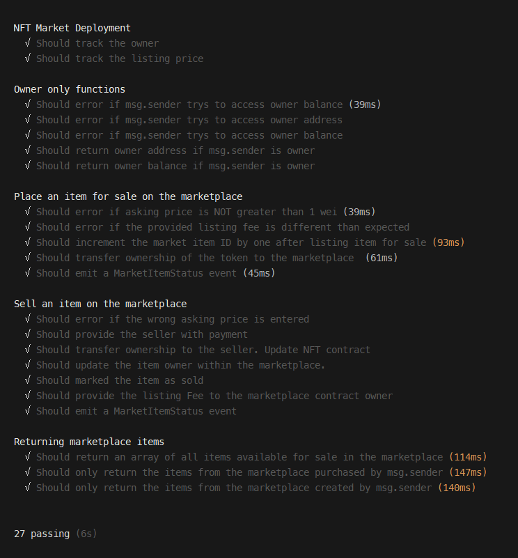

# Metaverse Marketplace - Dapp Application

<a href="https://metaverse-marketplace-passandscore.vercel.app/" class="button big">View NFT Marketplace</a>

<!-- ABOUT THE PROJECT -->

## About The Project

Implemented a NFT based Dapp application using Next.js and Matic's Mumbai testnet. The purpose of the application is to give users the ability to create digital assets (NFTs). They then have the option to place those assets on the marketplace for purchasing.

## What I learned

This was my first time implementing Next.js, Tailwind CSS, Hardhat and the Mumbai testnest. Fortunately for me, the documentation was well put together. I found that these technologies really worked well together. Hardhat made smart contract deployment a breeze while Next.js and Tailwind simplified the frontend process.

---

### Languages

- [Solidity](https://docs.soliditylang.org/en/v0.8.9/) 
- [JavaScript](https://www.javascript.com/)

### Built With

- [Matic](https://polygon.technology/)
- [Ethers](https://docs.ethers.io/v5/)
- [Hardhat](https://hardhat.org/)
- [MetaMask](https://metamask.io/)
- [IPFS](https://ipfs.io/)
- [Next.js](https://nextjs.org/)
- [Tailwind](https://tailwindcss.com/)
- [Heroku](https://heroku.com)

### Recommended Dependanices

- [Solidity Coverage](https://www.npmjs.com/package/solidity-coverage)
- [React Toastify](https://github.com/fkhadra/react-toastify#readme)
- [Web3 Modal](https://www.npmjs.com/package/web3modal)

---

## My Approach

### 1. Smart Contracts

#### Functionality

- Ensured the contract logic is simple.
- Modularized code to keep contracts and functions small.
- Used already-written tools and code where possible.
- Only used the blockchain for the parts of the system that require decentralization.

#### Security

- Re-entrancy is handled with a Re-entrancy Guard from the Open Zeppelin nonReentrant library. [See here](https://github.com/OpenZeppelin/openzeppelin-contracts/blob/master/contracts/security/ReentrancyGuard.sol)

#### Optimization

- Code duplication has been eliminated using previously-deployed contracts, mainly those that have been audited from [OpenZeppelin's Solidity Library](https://github.com/OpenZeppelin/openzeppelin-contracts)
- Event indexing allows you to search for these events using the indexed parameters as filters.

#### Design Patterns

Below are a couple of the design patterns that are implemented. I may have overlooked some of the patterns used within the imported Open Zeppelin libraries.

| Category      | Pattern                    |
| ------------- | -------------------------- |
| Authorization | Access restriction         |
|               | Ownership                  |
| Control       | Guard check                |
|               | Safemath                   |
| Maintenance   | Tight Variable Packing     |
| Security      | Check-effects-interactions |
|               | Mutex                      |

---

#### Functionality

- The users have the ability to connect their Metamask wallet in order to complete transactions. They can create NFTs and view them on [PolyScan](https://mumbai.polygonscan.com/). Furthermore, they can list them on the marketplace for others to purchase.

#### Notifications

- You will be notified regarding the following:

  | Error                            | Success                    | Info                       |
  | -------------------------------- | -------------------------- | -------------------------- |
  | MetaMask not installed           | NFT successfully purchased | Creating NFT...            |
  | MetaMask not connected           | NFT successfully listed    | Creating market listing... |
  | Invalid form input feilds        |                            |                            |
  | Transaction rejected by the user |                            |                            |
  | Any Metamask generated error     |                            |                            |

#### Framework

[Next.js](https://nextjs.org/) gives you the best developer experience with all the features you need for production: hybrid static & server rendering, TypeScript support, smart bundling, route pre-fetching, and more. No config needed.

#### Client-side Wallet

Available as a browser extension and as a mobile app, [MetaMask](https://metamask.io/) equips you with a key vault, secure login, token wallet, and token exchange—everything you need to manage your digital assets.

---

### 3. Unit Testing

[Hardhat](https://hardhat.org/) is Flexible. Extensible. Fast. Ethereum development environment for professionals.

---

### 2. Off-chain Storage

The InterPlanetary File System [IPFS](https://ipfs.io/) is a protocol and peer-to-peer network for storing and sharing data in a distributed file system. IPFS uses content-addressing to uniquely identify each file in a global namespace connecting all computing devices.

---

<!-- CONTACT -->

## Created By

- [Jason Schwarz | LinkedIn](https://www.linkedin.com/in/jason-schwarz-75b91482/)
